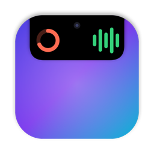

<p align="center">
  
</p>

<h1 align="center">EasyNotch</h1>

<p align="center">
  Your MacBook's notch, put to work: music controls, a file shelf with AirDrop, and a Pomodoro
  timer. Hover to open.
</p>

---

## What it does

EasyNotch draws over your notch at exactly its size, so when it's closed you can't tell it's
there. Hover over it, or click if you prefer, and it opens into a panel.

- **🎵 Music**
  - Spotify and Apple Music: cover art, title, a timeline you can drag, play/pause,
    previous/next, shuffle, repeat, and volume.
  - Switch between players when both are open.
- **📁 File shelf**
  - Drag files onto the notch, then drag them back out into an upload field, Slack, Mail,
    or Finder whenever you need them.
  - AirDrop them with one drop, Quick Look them, share them, or copy them.
  - The shelf follows files you rename or move.
- **🍅 Pomodoro timer**
  - Focus sessions, short breaks, and a long break every few sessions, with notifications
    and a sound you choose.
  - Keeps accurate time through sleep and restarts.
- **✨ Live activities.** While music plays or a timer runs, the closed notch grows small
  "wings" showing cover art with bouncing bars, or the time remaining.
- **⚙️ Customization**
  - **Size and timing:** size, hover and close delays, open by hover or click, and
    animation style.
  - **Look:** accent color.
  - **Tabs:** which tabs show, in what order, and which opens first.
  - **Screens:** show the notch on other screens (they get a virtual one), and hide it over
    full-screen apps.
  - **General:** a keyboard shortcut, launch at login, and export/import of your settings.
- **🪶 Light:** about 0% CPU while idle, and about 30 MB of memory.

## Requirements

- macOS 14 Sonoma or later.
- Made for MacBooks with a notch. Other screens get a virtual notch.
- For the music features, Spotify and/or Apple's Music app.

## Install

1. Download **EasyNotch-1.0.0.zip** from the
   [latest release](https://github.com/Sean13L/EasyNotch/releases/latest).
2. Unzip it and drag **EasyNotch** into your **Applications** folder.
3. Open it. macOS will say *"Apple could not verify 'EasyNotch' is free of malware…"*. Click
   **Done**.
   > This happens because EasyNotch isn't *notarized* (Apple's check for downloaded apps
   > needs a paid developer account). The app is signed, and its full source code is right
   > here.
4. Open **System Settings → Privacy & Security**, scroll down, click **Open Anyway** next to
   EasyNotch, and confirm.
5. Look for EasyNotch's icon in the menu bar, then hover over your notch.

**Tips**
- Right-click the notch, or use the menu-bar icon, to open **Settings**.
- To start EasyNotch automatically, go to Settings → General → *Open EasyNotch when you log
  in*.

## Permissions and privacy

EasyNotch asks only for what a feature needs, and only when you first use it:

| macOS asks… | Why | When |
|---|---|---|
| *"EasyNotch wants to control Spotify / Music"* | To play, pause, skip, and show cover art | When you press a music button or **Allow…** |
| Notifications | To tell you when a Pomodoro session ends | When you first start a timer |
| Access to Downloads, Desktop, or Documents | To reopen shelf files stored there | The first time a shelf file from that folder is shown |

EasyNotch doesn't need Accessibility or Screen Recording access.

It has no analytics and no accounts. The only thing it downloads is Spotify's cover art for
the song you're playing.

## Build from source

1. Install [Xcode](https://apps.apple.com/app/xcode/id497799835) (16 or later) and
   [XcodeGen](https://github.com/yonaskolb/XcodeGen):
   ```bash
   brew install xcodegen
   ```
2. In `project.yml`, change `DEVELOPMENT_TEAM` to your own team ID (Xcode → Settings →
   Accounts), or to `""` together with `CODE_SIGN_IDENTITY: "-"` to sign for your Mac only.
3. Generate the Xcode project and build:
   ```bash
   xcodegen generate
   xcodebuild -project EasyNotch.xcodeproj -scheme EasyNotch -configuration Release -derivedDataPath build build
   open build/Build/Products/Release/EasyNotch.app
   ```

Documentation for contributors:
- [docs/BLUEPRINT.md](docs/BLUEPRINT.md): architecture and design decisions
- [docs/DEVELOPMENT.md](docs/DEVELOPMENT.md): debugging tips and lessons learned
- [docs/QA_CHECKLIST.md](docs/QA_CHECKLIST.md): the hands-on test script

## License

[MIT](LICENSE) © 2026 Sean Le
